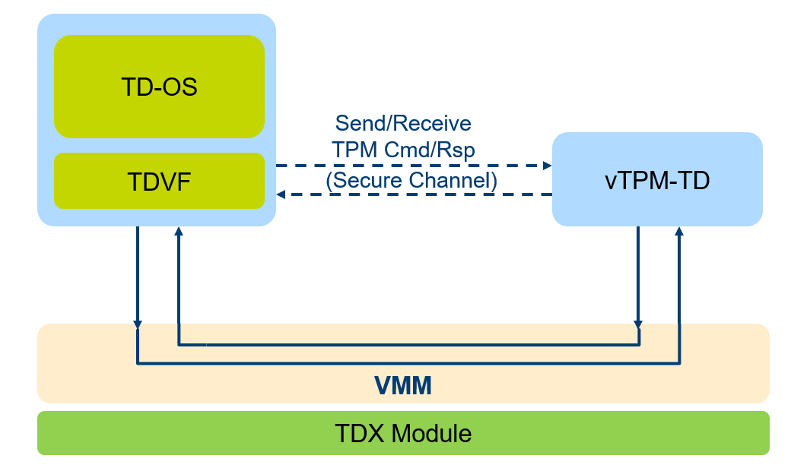

# rust-vtpm-td

A Trust Platform Module (TPM) provides the Root-of-Trust for Reporting (RTR) and Root-of-Trust for Storage (RTS) for the platform. With a platform specific Root-of-Trust for Measurement (RTM), usually the first boot code, the platform can support TPM-based attestation or TPM-based sealing.

In virtual platform, a virtual TPM (vTPM) may be used to support similar TPM-based attestation. It is widely adopted in the hypervisor environment and supported by the virtual machine monitor (VMM) vendor. A VMM may provide virtual TPM services to the guest environment.

However, with the Intel Trust Domain Extension, the VMM is out of Trust Computing Base (TCB) and no longer trusted. As such, a pure VMM-based virtual TPM is not feasible. We need have other way to support vTPM based solution.

rust-vtpm-td is a Trust Domain (TD) based vTPM solution, which can support vTPM functionality with VMM out of TCB.



## Known limitation

## Build

### Prerequisties

1. Rust toolchain

* Install [Rust](https://www.rust-lang.org/tools/install):
```
curl --proto '=https' --tlsv1.2 -sSf https://sh.rustup.rs | sh
```
* Install toolchain and components required by vtpmtd:
```
rustup toolchain install nightly-2023-12-31
rustup component add --toolchain nightly-2023-12-31 rust-src
cargo install cargo-xbuild
```

2. [clang](https://releases.llvm.org/download.html#13.0.1)

3. [NASM](https://www.nasm.us/)

### Dependant projects
rust-vtpm-td depends on below projects
| project|path| comments|
|--------|----|---------|
|[ms-tpm-20-ref](https://github.com/microsoft/ms-tpm-20-ref/tree/d638536d0fe01acd5e39ffa1bd100b3da82d92c7)|[deps/rust-tpm-20-ref/ms-tpm-20-ref](./deps/rust-tpm-20-ref/ms-tpm-20-ref/)|An official TCG reference implementation of the TPM 2.0 Specification|
|[musl](https://git.musl-libc.org/cgit/musl)|[deps/rust-tpm-20-ref/smallc/musl](./deps/rust-tpm-20-ref/smallc/musl/)|An Implementation of the C standard library|
|[openssl](https://github.com/openssl/openssl/tree/2cf4e90eaaf7402bf038b158dbdacd0a15561fb7)|[deps/rust-tpm-20-ref/openssl](./deps/rust-tpm-20-ref/openssl/)|A full-strength general cryptographic library|
|[spdm-rs](https://github.com/ccc-spdm-tools/spdm-rs/tree/f42eaf4680da0b0684ec1b9d64b7e417f8ff8160)|[deps/spdm-rs](./deps/spdm-rs/)|A rust version SPDM implementation|
|[td-shim](https://github.com/confidential-containers/td-shim/tree/abc721e6796bbc723da2aa2c1bdacd3bb2e0f661)|[deps/td-shim](./deps/td-shim/)|A simplified TDX virtual firmware for the simplified kernel for TD container|

### Prepare source code

```
mkdir vtpm
pushd vtpm
mkdir vtpm-td
mkdir vtpm-tdvf

git clone --recursive https://github.com/intel/vtpm-td.git vtpm-td
git clone --recursive --single-branch -b TDVF-vTPM-TD https://github.com/tianocore/edk2-staging vtpm-tdvf

export CC=clang
export AR=llvm-ar
```

### Build vtpm-td

```
# build vtpm-td service
pushd vtpm-td
git submodule update --init --recursive
# make dir for run-vtpm-td
mkdir ../run-vtpm-td
# build
bash sh_script/pre-build.sh
bash sh_script/build.sh
cp target/x86_64-unknown-none/release/vtpmtd.bin ../run-vtpm-td
popd
```

### Build vtpm-tdvf

```
pushd vtpm-tdvf
git submodule update --init --recursive
make -C BaseTools
source edksetup.sh
mkdir ../run-user-td
build -p OvmfPkg/OvmfPkgX64.dsc -t GCC5 -a X64 -D TPM2_ENABLE=TRUE -D VTPM_ENABLE=TRUE -b RELEASE
cp Build/OvmfX64/RELEASE_GCC5/FV/OVMF.fd ../run-user-td/
popd
```

## Run

### Prerequisites

1. Linux Kernel (KVM) and QEMU with with TDX 1.5 support

### Run vtpm-td in shell-A
```
pushd vtpm/run-vtpm-td
QEMU=/usr/bin/qemu-system-x86_64
BIOS=./vtpmtd.bin
USERTD_ID=aabbccdd-2012-ffff-1234-123456789abc
LOGFILE=./vtpm-td.log
MEM=256M

$QEMU \
  -accel kvm \
  -name debug-threads=on,process=vtpm-td \
  -cpu host,host-phys-bits,-kvm-steal-time,-arch-lbr \
  -smp 1 -m $MEM \
  -object tdx-guest,id=tdx,vtpm-type=server,vtpm-userid=${USERTD_ID},vtpm-path=unix:/tmp/vtpm-123.sock -qmp unix:/tmp/qmp-sock-vtpm,server,nowait \
  -object memory-backend-memfd-private,id=ram1,size=${MEM} \
  -machine q35,kernel_irqchip=split,confidential-guest-support=tdx,memory-backend=ram1 \
  -bios ${BIOS} \
  -nographic \
  -vga none \
  -no-hpet \
  -nodefaults \
  -chardev stdio,id=mux,mux=on,signal=off,logfile=$LOGFILE \
  -device virtio-serial,romfile= \
  -device virtconsole,chardev=mux -serial chardev:mux -monitor chardev:mux \
  -d int -no-reboot
```
### Communicate with QEMU via QMP in Shell-B
```
nc -U /tmp/qmp-sock-vtpm
{ "execute": "qmp_capabilities"}
{ "execute": "tdx-vtpm-create-instance", "arguments": { "user-id": "aabbccdd-2012-2022-1234-123456789abc" } }
```

### Run TDVF in Shell-C
```
pushd vtpm-poc/run-user-td
QEMU=/usr/bin/qemu-system-x86_64
BIOS=./OVMF.fd
USERTD_ID=aabbccdd-2012-2022-1234-123456789abc
MEM=4G
GUEST_IMAGE=/path/to/guest_image
KERNEL_IMAGE=/path/to/kernel_image

$QEMU \
  -accel kvm \
  -no-reboot \
  -name process=user-td,debug-threads=on \
  -cpu host,host-phys-bits,-kvm-steal-time,-arch-lbr \
  -smp 1 \
  -m ${MEM} \
  -object tdx-guest,id=tdx,vtpm-type=client,vtpm-userid=${USERTD_ID},vtpm-path=unix:/tmp/vtpm-123.sock \
  -object memory-backend-memfd-private,id=ram2,size=${MEM} \
  -machine q35,kernel_irqchip=split,confidential-guest-support=tdx,memory-backend=ram2 \
  -bios $BIOS \
  -nographic \
  -vga none \
  -chardev stdio,id=mux,mux=on,signal=off \
  -device virtio-serial,romfile= \
  -device virtconsole,chardev=mux \
  -serial chardev:mux \
  -monitor chardev:mux \
  -drive file=${GUEST_IMAGE},if=virtio,format=qcow2 \
  -device virtio-net-pci,netdev=mynet0 \
  -netdev user,id=mynet0,hostfwd=tcp::10038-:22 \
  -kernel ${KERNEL_IMAGE} \
  -append "root=/dev/vda1 ro console=hvc0" \
  -monitor pty \
  -monitor telnet:127.0.0.1:9021,server,nowait \
  -no-hpet \
  -nodefaults
```
## Verify
After booting up to TD guest OS, vTPM features can be used as normal TPM. It can be verified by:
* [tpm2-tools](doc/verify-vtpm-features.md#tpm2-tools)
* [Linux IMA (Integrity Measurement Architecture)](doc/verify-vtpm-features.md#linux-ima)
* [Quote Verification](doc/verify-vtpm-features.md#quote-verification)
* [Keylime](doc/verify-vtpm-features.md#keylime)

## Reproducible Build

Reproducible build of vtpm-td binary requires same system user and
source code path (see https://github.com/intel/vtpm-td/issues/101).

The [Dockerfile](./Dockerfile) is provided to build the docker image with
the vtpm-td compilation environment for reproducible build. You can use the
[docker.sh](./sh_script/docker.sh) to build and run the docker container:

```
./sh_script/docker.sh -f ./
```
