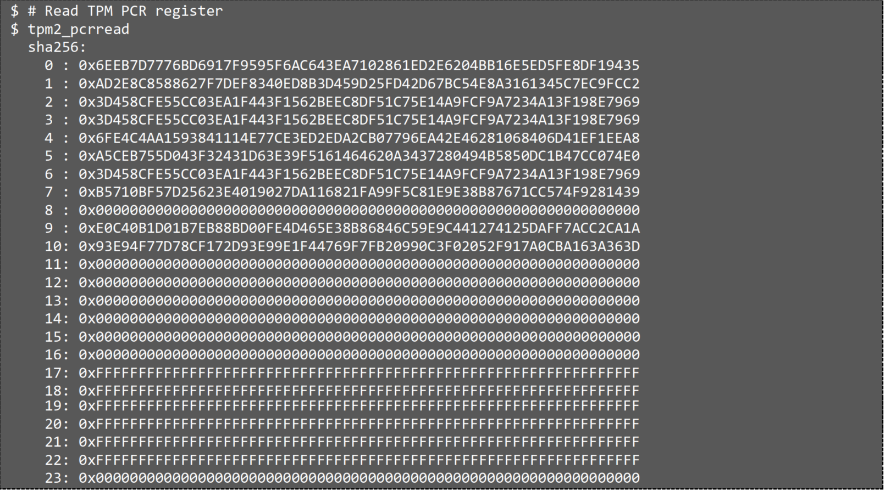

# Verify vTPM features
After booting up to TD guest OS, vTPM features can be used as normal TPM. It can be verified by:
* [tpm2-tools](#tpm2-tools)
* [LinuxIMA (Integrity Measurement Architecture)](#linux-ima)
* [Keylime](#keylime)
## tpm2-tools
It’s recommended to build and install tpm2-tools in TD guest image.
Please install the following dependencies before building and installing tpm2-tools.
```
$ sudo apt-get -y install \
      autoconf-archive libcmocka0 libcmocka-dev procps iproute2 \
      build-essential git pkg-config gcc libtool automake libssl-dev \
      uthash-dev autoconf doxygen libjson-c-dev libini-config-dev \
      libcurl4-openssl-dev uuid-dev libltdl-dev libusb-1.0-0-dev \
      libarchive-dev clang libglib2.0-dev
```
Follow document: https://tpm2-tools.readthedocs.io/en/latest/INSTALL/ to build and install tpm2-tools.

Run [tpm2_pcrread](https://tpm2-tools.readthedocs.io/en/latest/man/tpm2_pcrread.1/) to read the PCR registers.


## Linux IMA
Linux IMA (Integrity Measurement Architecture) is enabled by extending IMA measurement
to RTMR and vTPM PCRs, which enables user space application runtime measurement.
Runtime measurements within TD guest can avoid being compromised and use to attest to
the system's runtime integrity.

## Keylime
vTPM can be used for [Keylime](https://github.com/keylime/rust-keylime) to do remote attestation
with Linux IMA enabled. Keylime verifier will do continually remote attestation with Linux IMA
measurement records protected with vTPM from Keylime agent deployed inside TDVM and compare against
know good values provided by trusted admin or third parties.

Note: Keylime must include the patch#88e033c3a which fixes the SHA1 issue for TPM PCR16.

## Quote Verification
### Precondition
Refer to [Whitepaper: Linux* Stacks for Intel® Trust Domain Extension 1.0](https://www.intel.com/content/www/us/en/content-details/783067/whitepaper-linux-stacks-for-intel-trust-domain-extension-1-0.html) to set up Attestation environment.
- Follow chapter 4.3.2 to "Set Up DCAP Repo(Host)"
- Follow chapter 4.3.3 to "Set Up PCCS"
- Follow chapter 4.3.4 to "Set Up DCAP on Host"
- Follow chapter 4.3.6 to build quote verification sample application

### Export CA certificate from vTPM NV
Run below script on guest OS to export CA.
```
 #!/bin/bash

rm -rf ca_cert*
NVINFO=`tpm2_nvreadpublic`

for i in {0..5}; do
      INDEX=0x1c0010$i
      if [[ $NVINFO == *"$INDEX"* ]]
      then
      NV_SIZE=`tpm2_nvreadpublic $INDEX | grep size |  awk '{print $2}'`
      tpm2_nvread --hierarchy owner --size $NV_SIZE --output ca_cert$i.bin $INDEX
      cat ca_cert$i.bin >> ca_cert.bin
      fi
done
```
### Convert CA certificate format from der to pem
Run below script on guest OS to export CA.
```
openssl x509 -inform DER -in ca_cert.bin -outform PEM -out ca_cert.pem
```
### Export quote data from CA with python script
Run below python script to export quote.data from CA.
```
// pip install pyopenssl
import OpenSSL

quote_extension_index=2

cert = OpenSSL.crypto.load_certificate(OpenSSL.crypto.FILETYPE_PEM, open("ca_cert.pem").read())
certIssue = cert.get_issuer()

with open("quote.data", "wb") as fp:
    fp.write(cert.get_extension(quote_extension_index).get_data())
    print("quote data export successfully: quote.data")
```
### Copy quote.date from guest OS to host
```
virt-copy-out -a <guest_image_name> <directory_in_TDVM_contains_quote.data>
<host_directory>
```
### Verify quote date with sample application
```
./app -quote <PATH>/quote.data
```